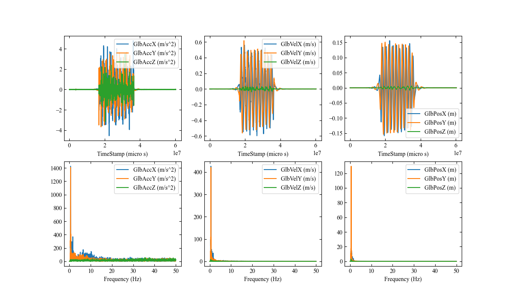
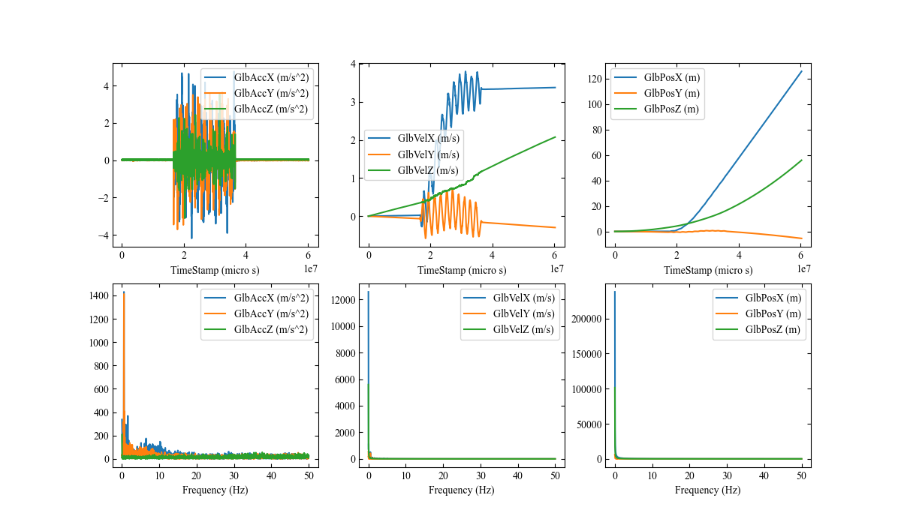
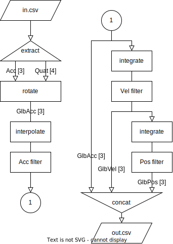

# LPMS-B2 を用いた位置推定プログラム LPMS-self-localization

**LPMS-self-localization** は LPMS-B2 のデータから装置の位置を推定するプログラムである．

**LPMS-B2** は加速度，角速度，磁場それぞれについて三軸のセンサーを持つ装置である．
センサーの測定データの時間変化に加え，測定データから計算された装置自身の姿勢（向きと回転）を csv として出力できる．

LPMS-self-localization は LPMS-B2 の出力した加速度と姿勢のデータを入力としてうけとる．
回転操作とノイズ除去，積分計算を行い，装置の速度と位置を推定して csv として出力する．

(現在、フィルター処理は無効化している)

```sh
$ < in.csv | poetry run lpms_self_localization.py | out.csv
```

---

# LPMS-B2

## LPMS-B2 の操作説明

まず， LPMS-B2の取り扱いについて以下に示す．
詳しくは[公式サイト](https://lp-research.com/9-axis-bluetooth-imu-lpmsb2-series/)を参照すること．

### 本体の起動

本体表面，中央のボタンを短く押すと電源が入り， LED が点滅する．もう一度短く押すと電源が切れて、 LED が消灯する．

### 本体の充電

USB ケーブルによって充電を行う．装置の状態と充電状況は LED に表示される．

|      |LED         |色|バッテリー|
|------|:----------:|--|---------:|
|未接続|点滅        |青|> 10%     |
|      |            |赤|< 10%     |
|接続  |ゆっくり点滅|青|> 10%     |
|      |            |赤|< 10%     |
|充電中|点灯        |緑|> 90%     |
|      |            |青|20% ~ 90% |
|      |            |赤|< 20%     |

### Windows 設定

**設定** > **デバイス** > **Bluetooth とその他のデバイス** の順で選択する．
「**Bluetooth またはその他のデバイスを追加する**」 から **LPMSB2-xxxxxx** を追加する．
（接続時 PIN コードの入力を求められた場合，**1234** を入力する．）

### LPMS-Control のインストール

[インストーラー](https://lp-software-downloads.s3-ap-northeast-1.amazonaws.com/LPMS/LPMS-Control/OpenMAT-1.3.5-Setup-Build20180418.exe)をダウンロードし，指示に従う．

### LPMS-Control の設定

インストールされた LPMS-Control を起動する．

ツールバーのを選択する．
**Scan devices** から，上で接続したデバイスを選択し，**Add device** を実行する．

ツールバーのを選択し，接続を行う．
ウィンドウの左側 **Connected devices** に，接続済みのデバイス一覧が表示される．
これをクリックすると，デバイスごとに計測についての設定ができる．

### 計測の実行

#### データの記録をしない計測

ツールバーのを選択することで計測が開始し，アイコンが変化すると同時に画面のグラフが更新される．

ツールバーのを選択することでグラフの更新が停止される．

#### データの記録をする計測

ツールバーのを選択することで，計測データの保存先を指定する．

ツールバーのを選択することでで画面のグラフが更新され，アイコンが変化すると同時に記録を開始する．

ツールバーのを選択することで記録が終了し，データが保存される．

---

# LPMS-self-localization

## 実行環境

- OS
    - Windows10
- 言語
    - Python 3.10.2
- 使用ツール
    - poetry

## LPMS-self-localization の操作説明

LPMS-self-localization はコマンドラインアプリケーションである．

以下，スクリプト本体である`lpms_self_localization.py`と入力ファイル`in.csv`がカレントディレクトリに存在するとして手順を解説する．
また， poetry をつかう場合は `pyproject.toml` も同じディレクトリに必要．
実際の環境に応じて適宜読み替える．

### 入力ファイル

LPMS-B2 の出力した csv を想定している．

```csv
SensorId, TimeStamp (s), FrameNumber, AccX (g), AccY (g), AccZ (g), GyroX (deg/s), GyroY (deg/s), GyroZ (deg/s), MagX (uT), MagY (uT), MagZ (uT), EulerX (deg), EulerY (deg), EulerZ (deg), QuatW, QuatX, QuatY, QuatZ, LinAccX (g), LinAccY (g), LinAccZ (g), Pressure (kPa), Altitude (m), Temperature (degC), HeaveMotion (m)
1, -0.0000, 0, -0.00133558, 0.00810515, -1.00156462, -0.02118125, 0.04246204, -0.04839651, -5.48615694, -19.48448944, -50.30708694, -0.39996749, -0.02038799, 13.98081589, 0.99256057, 0.00344277, 0.00060138, -0.12170178, 0.00098058, -0.00113269, 0.00158901, 0.00000000, 0.00000000, 0.00000000, 0.00000000
1, 0.0100, 1, -0.00057623, 0.00844607, -1.00184143, 0.06752539, -0.06167802, -0.01470590, -5.06619167, -20.21798515, -50.47650909, -0.40040997, -0.02113543, 13.98071480, 0.99256063, 0.00344581, 0.00060832, -0.12170088, 0.00021216, -0.00146058, 0.00186592, 0.00000000, 0.00000000, 0.00000000, 0.00000000
~~~
```

一行目は index で，
二行目以降はサンプリング周期（サンプリング周波数の逆数）ごとの記録である．ただし，抜け値があっても補完される．

以下の項目の列を使用する．

- `TimeStamp (s)`
- `QuatW`, `QuatX`, `QuatY`, `QuatZ`
    - 装置の姿勢を表すクォータニオン．
- `LinAccX (g)`, `LinAccY (g)`, `LinAccZ (g)`
    - 装置のローカル座標（装置とともに回転する座標）における加速度ベクトル．

### 出力ファイル

出力も csv ファイルである．

```csv
TimeStamp (s),GlbAccX (m/s^2),GlbAccY (m/s^2),GlbAccZ (m/s^2),GlbVelX (m/s),GlbVelY (m/s),GlbVelZ (m/s),GlbPosX (m),GlbPosY (m),GlbPosZ (m)
0.0,-0.0014813453779337921,0.00222195072336769,-0.0026821516633868453,0.0010545757589158283,-0.0005023715310496541,-0.0004318198842182416,0.00015926893899131738,-9.759206722305912e-05,-4.676710606190995e-05
0.01,-0.007872993952671024,-0.0027848474389441406,2.4489575976874636e-05,0.001050108305391559,-0.0005263783494378711,-0.0004590361127746628,0.00017440723503609496,-0.00010496187579569892,-5.234247749315873e-05
0.02,-0.007780479256624093,0.007715860968205078,-0.008363194049216783,0.0010141883523501326,-0.0005229255219067897,-0.0005146789059799428,0.00018938802692348967,-0.00011245640431377176,-5.8347802401783e-05
~~~
```

一行目は index で， 二行目以降はサンプリング周期（サンプリング周波数の逆数）ごとの記録である．

以下の項目の列が出力される．

- `TimeStamp (s)`
- `GlbAccX (m/s^2)`, `GlbAccY (m/s^2)`, `GlbAccZ (m/s^2)`
    - 装置のグローバル座標（地面に固定された座標）における加速度ベクトル．
- `GlbVelX (m/s)`, `GlbVelY (m/s)`, `GlbVelZ (m/s)`
    - 装置のグローバル座標（地面に固定された座標）における速度ベクトル．
- `GlbPosX (m)`, `GlbPosY (m)`, `GlbPosZ (m)`
    - 装置のグローバル座標（地面に固定された座標）における位置ベクトル．

### 操作方法と例
#### 初回起動時
```sh
$ python -m pip install poetry
```

で， poetry をインストールする．

```sh
$ python -m poetry install
```

で，必要なライブラリをインストールする．

```sh
$ poetry run python lpms_self_localization.py -h
```

でヘルプが表示されれば問題なし．

#### 操作

```sh
$ < in.csv | poetry run python lpms_self_localization.py | out.csv
```

または

```sh
$ poetry run python lpms_self_localization.py in.csv -o out.csv
```

で，処理の結果を`out.csv`に出力する．

簡単なグラフを確認したい場合は

```sh
$ poetry run python lpms_self_localization.py in.csv -o out.csv -p plot.png
```

でプロットを`plot.png`に出力する．




のように設定する．



### オプションの解説

- `-h, --help`
    - ヘルプを表示する．
- `-o OUTPUT, --output OUTPUT`
    - 推定された加速度，速度，位置のデータを csv として出力する先を指定する． 指定がなければ標準出力に出力する．
- `-p PLOT, --plot PLOT`
    - プロット (png) の出力先を選ぶ． 指定がなければ出力しない．
- `-f FREQ, --freq FREQ`
    - 入力データのサンプリング周波数 (Hz) を指定する． 指定がなければデータから推定する．
- `-i INTERPOLATE, --interpolate INTERPOLATE`
    -   抜け値の補完メソッドを指定する． pandas.DataFrame.interpolate によって補完が行われる． 指定がなければ線形補完とする．

## LPMS-self-localization が行う処理の説明

LPMS-self-localization が行う処理をフローチャート図で示す．

(現在、フィルター処理は無効化している)



1. extract
    - `in.csv`から，ローカル座標（装置とともに回転する座標）における加速度ベクトルである`LinAccX (g)`, `LinAccY (g)`, `LinAccZ (g)`列（以下，まとめて`Acc[3]`と呼ぶ）と姿勢を表すクォータニオンの`QuatW`, `QuatX`, `QuatY`, `QuatZ`列（以下，`Quat[4]`と呼ぶ）を取り出す．
1. rotate
    - `Acc[3]`を`Quat[3]`によって回転し，グローバル座標（地面に固定された座標）における加速度ベクトル`GlbAcc[3]`を得る．
1. interpolate
    - `GlbAcc[3]`の抜け値を補完し，時間の刻み幅を一定にする．
1. Acc filter
    - `GlbAcc[3]`にバターワースフィルタリングを行う．
1. integrate
    - `GlbAcc[3]`を積分して，速度ベクトル`GlbVel[3]`を得る．
1. Vel filter
    - `GlbVel[3]`にバターワースフィルタリングを行う．
1. integrate
    - `GlbVel[3]`を積分して，位置`GlbPos[3]`を得る．
1. Pos filter
    - `GlbPos[3]`にバターワースフィルタリングを行う．
1. concat
    - `GlbAcc[3]`, `GlbVel[3]`, `GlbPos[3]`を結合して`out.csv`とする．
